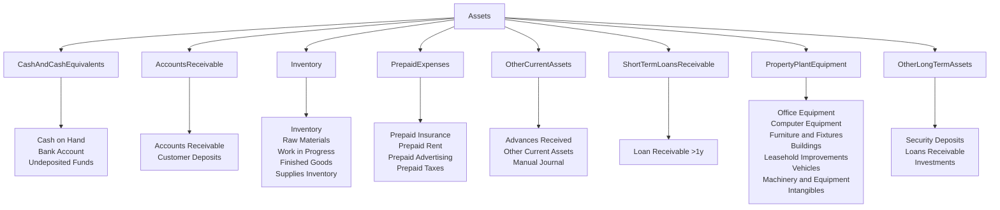
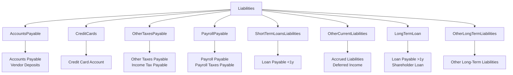

import Mermaid from '@theme/Mermaid';
import Tabs from '@theme/Tabs';
import TabItem from '@theme/TabItem';

## What is a Chart of Accounts?

A Chart of Accounts (CoA) is a fundamental tool for organizing your business finances. It acts as a roadmap, helping you categorize transactions and group similar accounts for reporting and analysis.

In Fiskl, you can view your Chart of Accounts filtered by account type or as a complete list.

## Account types

Your Chart of Accounts is divided into five main account types:

1. Assets
2. Liabilities
3. Equity
4. Income
5. Expenses

Let's explore each of these account types in more detail.

### Assets

Assets are resources your business owns that have economic value.

Examples include:

- Cash
- Bank accounts
- Inventory
- Equipment
- Accounts receivable (money owed to you by customers)

Assets appear on your Balance Sheet and are categorized based on their nature, use, and how quickly you can convert them to cash (liquidity).

### Liabilities

Liabilities are debts or financial obligations your business owes to others.

Examples include:

- Bank loans
- Mortgages
- Unpaid bills
- Sales taxes owed

Liabilities appear on your Balance Sheet and are classified as either current (to be paid within a year) or non-current (long-term obligations).

### Equity

Equity represents your company's net worth or book value. It's the difference between your assets and liabilities.

Equity can increase through:

- Profitable operations
- Capital contributions by shareholders
- Increases in asset values

Equity can decrease due to:

- Losses
- Dividend payments
- Share repurchases

### Income

Income accounts show how much your company has earned through its primary business activities.

Key points about income accounts:

- They represent revenue from sales of goods, services, or other activities
- A credit increases income, while a debit decreases it
- Income appears on your income statement

### Expenses

Expense accounts show how much your company has spent on its operations.

Key points about expense accounts:

- They represent costs incurred in generating revenue
- A debit increases expenses, while a credit decreases them
- Expenses appear on your income statement and are subtracted from revenue to calculate net income

## Managing your Chart of Accounts in Fiskl

Fiskl provides a comprehensive selection of commonly used accounts. You can also add custom categories to match your specific business needs.

To access your Chart of Accounts:

1. Select "Accounting" from the left menu
2. Choose "Chart of Accounts" from the submenu

<details>
<summary>Why is a well-structured Chart of Accounts important?</summary>

A properly maintained Chart of Accounts:

- Enables effective financial management
- Supports informed decision-making
- Organizes financial data systematically
- Facilitates accurate reporting of your financial position and performance
- Establishes a foundation for sound accounting practices
- Ensures reliable financial information is available when needed

</details>

## Visualize the default Chart of Accounts

<details>

    <summary>Show a visual view of the default Chart of Accounts</summary>

<Tabs>
  <TabItem value="assets" label="Assets" default>



  </TabItem>
  <TabItem value="Liabilities" label="Liabilities">



  </TabItem>
    <TabItem value="equity" label="Equity">

      ```mermaid
      flowchart TD
          Equity --> OwnersEquity
              OwnersEquity --> OE["Share Capital\nOpening Balance\nOwner's Draw\nRetained Earnings\nProfit for the Year"]
      ```

      </TabItem>
    <TabItem value="income" label="Income">

      ```mermaid
flowchart TD
    Income --> OperatingIncome
    Income --> OtherIncome
    Income --> UncategorisedIncome

    OperatingIncome --> OI["Sales\nSales of Products\nSales of Services\nSales - Billed Expenses\nSales - Other\nDiscounts\nRefunds Given"]
    OtherIncome --> OInc["Dividend Income\nInterest Earned\nOther Income"]
    UncategorisedIncome --> UInc["Uncategorised Income"]

      ```

      </TabItem>
    <TabItem value="expenses" label="Expenses">

      ```mermaid
flowchart TD
    Expenses --> CostOfSales
    Expenses --> OperatingExpenses
    Expenses --> OtherExpenses
    Expenses --> UncategorisedExpenses

    CostOfSales --> COS["Cost of Goods Sold\nCost of Labour - COS\nSupplies & Materials - COS\nShipping & Delivery - COS\nOther Costs of Sales - COS\nBillable Expenses - COS"]
    OperatingExpenses --> OpExp["Travel - Accommodation\nAdvertising & Promotion\nTravel - Transportation\nBank Charges\nEntertainment & Meals - Business\nInsurance\nContractors\nDividends Paid\nEducation & Training\nEmployee Benefits\nFuel & Mileage\nInternet & Phone\nEntertainment & Meals - Non-business\nOther Miscellaneous Expenses\nOffice Equipment & Hardware\nOffice Supplies\nTravel - Other\nPostage & Printing\nLegal & Professional Fees\nLease or Rent\nRepairs & Maintenance\nEntertainment - Staff\nSubscriptions & Memberships\nLicenses & Other Taxes\nTaxi & Parking\nUse of Home\nUtilities\nPayroll - Salary & Wages\nPayroll - Taxes\nPayment Processing Fees"]
    OtherExpenses --> OExp["Depreciation\nInterest Paid\nRealised Exchange Gain or Loss\nUnrealised Exchange Gain or Loss\nCompany Taxes\nOther Expenses"]
    UncategorisedExpenses --> UExp["Uncategorised Expenses"]

      ```
    </TabItem>
</Tabs>

</details>

Remember: Your Chart of Accounts is a living document. As your business grows and changes, you may need to add, remove, or modify accounts to keep your financial structure aligned with your operations.
