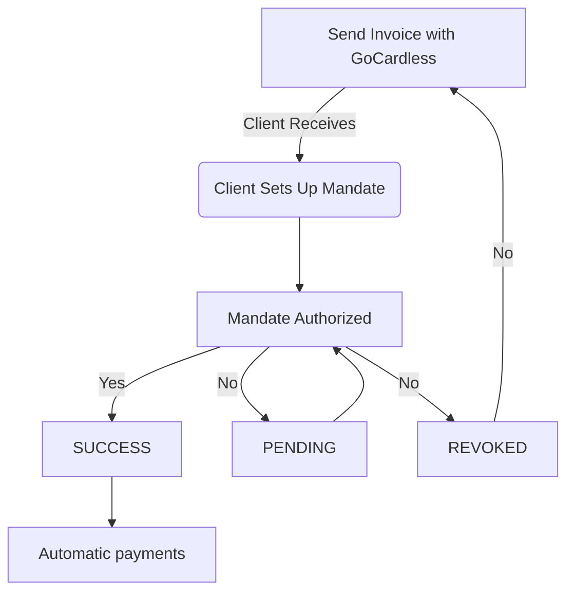

<!-- import TOCInline from '@theme/TOCInline'; -->
import Mermaid from '@theme/Mermaid';

Clients are essential for managing your business interactions in Fiskl. They are used in invoices, quotes, and accounting transactions, helping you keep track of all financial activities. By adding and managing clients effectively, you ensure accurate and organized financial records, making your invoicing and quoting processes efficient and reliable.

## Before you start

Before creating clients, it's helpful to have:

1. Your company details set up in ```Company Settings```
2. A clear understanding of your client's billing requirements (e.g., currency preferences, tax information)
3. Any specific time rates for clients who are billed hourly

## Managing clients

### Creating a new client

Follow these steps to add a new client:

1. From the left menu, click on "Clients & Vendors" and select the "Clients" tab
2. Click on "New client"
3. In the client name, search for your client name or business name
4. Select your the client and their details will be automatically populated
5. Add client email
6. Add Cc and Bcc
7. Edit the address layout if required

:::info[tip]
Review and adjust the custom format of the address as this is the exact layout that will be on the invoices and quotes.
:::

#### Defaults

You can add a default currency and time rate which will be applied when creating invoices and time items.

### Importing clients

To import multiple clients at once:

<details>
<summary>Learn how to import clients from a CSV file</summary>

1. Go to "Clients & Vendors" from the left menu and click on "Clients"
2. Click the "Import" button at the top of the client list
3. Select "Import client details" and choose a .csv file from your device
4. Match the .csv column headers with the field names in Fiskl
5. Click "Import"
6. Review the preview of client items and click "Import" again
7. You'll receive a notification of the number of clients added to your list

</details>

:::info
You can easily import your contact list using the Fiskl app in Android or iOS.
:::

### Viewing and managing your client List

The client list provides a quick overview of your clients and their key information.
From this list, you can perform common tasks like creating invoices, viewing client-specific details, and managing your client database.
Use the sorting and filtering options to find specific clients quickly, and access additional actions through the menu next to each client name.

:::info[tip]
Explore the options available in the client list to streamline your client management workflow.
:::

### Direct Debit mandates

Fiskl supports setting up Direct Debit mandates for automatic payments using [GoCardless.](../../Integrations/Payment-Gateways/gocardless-integration.md)
In the client list you will be able to see the status of their Direct Debit mandate.

#### Direct Debit mandate flow



# Best practices for client management

- Keep client information up to date, especially contact details and tax information
- Use client-specific currencies and time rates for accurate invoicing
- Regularly review your client list and archive inactive clients
- Utilize direct debit mandates for recurring clients to streamline payments

Remember: Effective client management in Fiskl helps streamline your invoicing, quoting, and payment processes, leading to better financial organization and client relationships.
