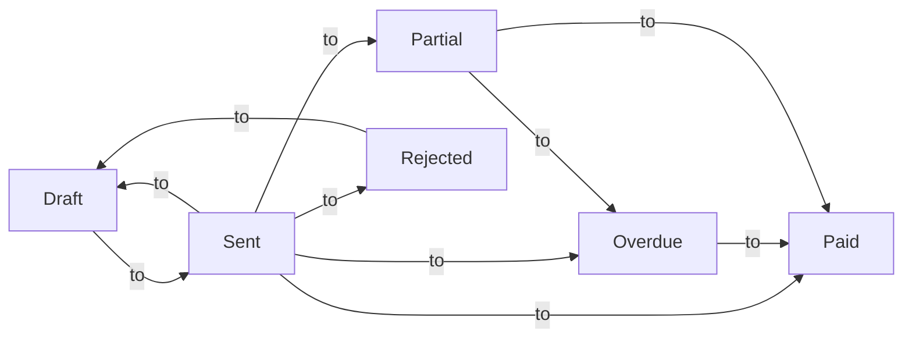
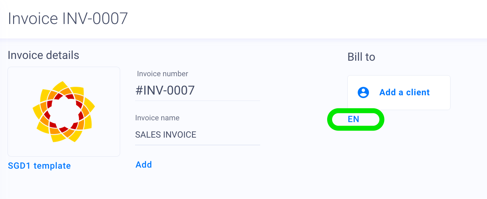
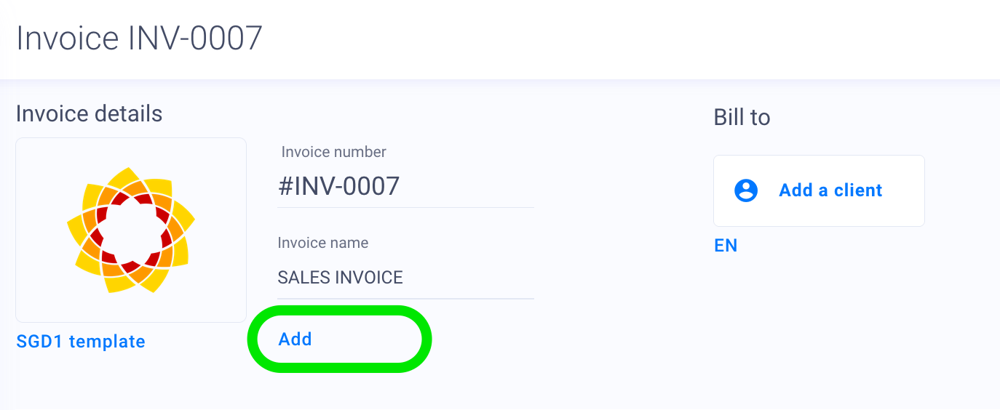
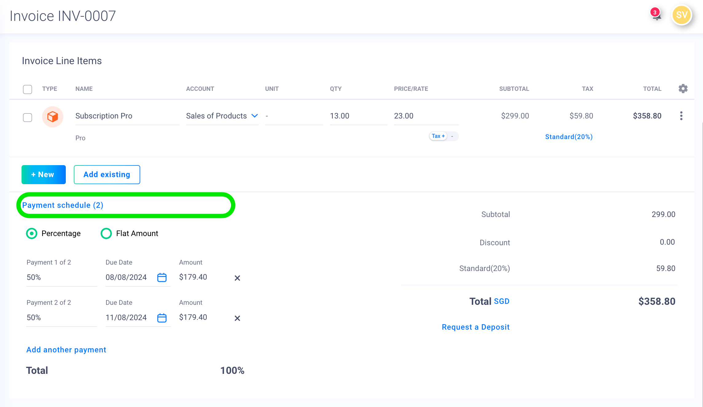

import TOCInline from '@theme/TOCInline';
import Mermaid from '@theme/Mermaid';

Invoicing in Fiskl ranges from basic to sophisticated. We will run through creating a basic invoice and then address each part of the invoice individually to explore the more advanced features. 
You can create everything as you create your first invoice, but it can be useful to have the following set up in advance:

<!-- 1. Complete your [Company Settings](../Getting-Started/company-settings). Ensure your address is correct -->
2. Create a Client
3. Create a Payment Method. This can be using an integrated payment gateway like Stripe or adding a Manual Payment method

## Basic invoice

Try the interactive demo to create a basic invoice.

  <iframe
    style={{ position: 'absolute', top: 0, left: 0, width: '100%', height: '100%', border: 0 }}
    src="https://demo.fiskl.com/e/clzctmgxx008yl30czzc6urmn/tour"
    allowFullScreen
    webkitallowfullscreen="true"
    mozallowfullscreen="true"
    allowtransparency="true"
  ></iframe>

---

### Parts of an invoice 

Let's look at each part of the invoice in detail. 

<TOCInline toc={toc} />

---

#### Company 
[[dashboard]](https://my.fiskl.com/company-settings)

<!-- The invoice uses the following information from [Company Settings](../Getting-Started/company-settings): -->

1. Company name
2. Company address
3. Company ID or Registration number

:::info
<!-- All of the above can be overridden when using a [Brand Template](../Getting-Started/templates-and-brands). -->

<!-- Your Company ID is not shown by default. You can change this in [Additional display options](../Getting-Started/templates-and-brands#additional-display-options) on your template. -->
:::

:::info[tip]
<!-- In both [Company Settings](../Getting-Started/company-settings) and [Brand Template](../Getting-Started/templates-and-brands) you can customize your address layout to change how it appears on the invoice and quotes. -->
:::

---

#### Client 
[[dashboard]](https://my.fiskl.com/partners/clients)

A [Client](../Clients-Vendors/clients) is required to create an invoice. You can create your client in advance or while creating the invoice.

The invoice uses the following information from [Client](../Clients-Vendors/clients):

1. Client name
2. Client address
3. Client email including Cc and Bcc
4. Tax/Vat Registration Number
5. Defaults
   1. Currency
   2. Time rate
              
:::info
The format of the address can be changed in [Client](../Clients-Vendors/clients#address).

Client Tax/VAT Registration Number is shown by default if set on the client [Client](../Clients-Vendors/clients#general).
:::

---

#### Invoice number

The default invoice number is INV-0001 and increments each time a new invoice is created. 
You can alter the invoice number to any format you like, but there are some limitations:
1. Fiskl can only increment the invoice number if it ends with a digit 
2. If your invoice follows a date pattern like 2024-01-0001, you will need to manually change the invoice number at each date period

**How to change the invoice number?**
You change the format of the invoice number when creating a new invoice. Change the invoice number to the new format, and all following invoices will follow this pattern.

:::info
When a new invoice is created, Fiskl looks for the latest invoice and increments that invoice number. If you plan to change the invoice and have future invoices use this format, it needs to be on the most recent invoice.
:::

---

#### Invoice dates

There are three dates on the invoice:

1. Invoice Date: The date the invoice was created
2. Due Date: The date the invoice is due
3. Sale Date: (Optional)

:::info
By default, the Due Date is 7 days after the Invoice Date. This default setting can be changed in [Invoice & Quote settings](../../Settings-Configurations/invoice-and-quote-settings).
:::

The [Invoice Overdue Status](#invoice-status) is based on the Due Date and the Invoice Payments. If the invoice is not fully paid on the Due Date, then the invoice will become Overdue. If there are any Overdue Reminders, they will be sent based on the Due Date and the overdue reminder chosen. 

---

#### Invoice Status

Invoices have the following statuses and flows:

:::info
The invoice statuses work using the Due Date and the payments. E.g., if an invoice of $100 has a payment of $100, then the status will be Paid. If you change the payment to $80, the status will be Partial.

If you need to edit an invoice with payments, you can change the status to Open to make it editable. However, as soon as you change it, it will revert to Paid.
What happens is that we disable the payments on the invoice, allowing you to change the status to Open so that you can edit the invoice. When you save it, if there are any payments, we will restore these. 
:::

---

#### Styling
<!-- You can style the invoice using themes, colors, and fonts. These are all done in the [Template](../Getting-Started/templates-and-brands) under Themes, Colours, and Fonts. -->

:::info[warning]
Any changes to the templates will affect all invoices using that template.
:::

---

#### Line items

Line items can be created inline when creating the invoice or in advance in their dedicated screens. 

- [Products*](../Line-Items/products)
- [Services*](../Line-Items/services)
- [Expenses](../Line-Items/expenses)
- [Mileage](../Line-Items/mileage)
- [Time](../Line-Items/time)

Products and Services are templates. When you create or add a product to an invoice, a line item version of the Product or Service is created. 
Expenses, Time & Mileage are top-level line items, and when added to an invoice, they become Billable, i.e., they are assigned a client. 

#### Taxes

Line items can have single, multiple, or compound taxes. 

Taxes are calculated at the line item level and displayed on the invoice. 

---

#### Discounts

You can add an invoice-level discount either as an amount or percentage by clicking on the discount link in the invoice.

Examples: 
>$100 discount = 100

>15% discount = 15%

---

#### Deposits

You can request a deposit either as an amount or percentage by clicking on the deposit link in the invoice. 

Examples: 
>$100 deposit = 100

>15% deposit = 15%

---

#### Currency

You can change the currency of an invoice by selecting the currency name next to the Total. 

By default, the invoice currency is the same as your Company currency unless you select a Client that has a default Currency that is different. 

Changing the invoice currency will not change the currency of the line items already added, but new in-line line items added will default to the invoice currency. 

:::info
You can adjust the exchange rate for line items that are not in the same currency as the invoice.
:::

---

#### Language

You can choose from over 60 languages for invoices & quotes. Changing the language of an invoice not only changes the invoice but also the default emails and the invoice and payment screens your customer sees.   

The default language of the invoice is set in [Invoice & quote settings](../../Settings-Configurations/invoice-and-quote-settings), but you can change it per invoice by language abbreviation below the client selector. 

---

#### Additional values

You can add some additional information to the invoice, like a PO Number. 

---

#### Notes

You can add notes directly to the invoice, or you can default what notes are added to every invoice in [Invoice & quote settings](../../Settings-Configurations/invoice-and-quote-settings).

---

#### Payment options
[Content for Payment options to be added]

---

#### Payment terms

By default, the payment terms are 7 days after the invoice is created. When the invoice is created, it's assigned an Invoice Date, and the Due Date is calculated by adding 7 days. 

You can alter the default in [Invoice & quote settings](../../Settings-Configurations/invoice-and-quote-settings).

---

#### Payment schedules 

A payment schedule is a payment plan for a single invoice. 

You can create a schedule of 2 to 12 payments. The schedule can be in flat amounts or percentages of the invoice.

For example, you can create a payment schedule that is:

> Payment 1: 50%
> Payment 2: 25%
> Payment 3: 25%

OR

Invoice of 500

> Payment 1: 300
> Payment 2: 150
> Payment 3: 50

:::info[tip]
Payment schedules are a good way of allowing your customers to pay in installments and are useful for just a few payments. Consider using recurring invoices for more long-term recurring payments. 
:::

---