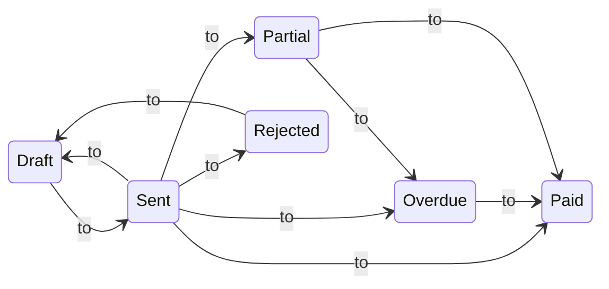

import TOCInline from '@theme/TOCInline';
import Mermaid from '@theme/Mermaid';

Fiskl offers a range of invoicing options, from basic to sophisticated. This guide will walk you through creating a basic invoice and then explore each component in detail for more advanced features.

## Before you start

While you can set up everything as you create your first invoice, it's helpful to have the following in place:

1. Complete your `Company Settings`, ensuring your address is correct
2. Create a client
3. Set up a payment method (either an integrated payment gateway like Stripe or a manual payment method)

## Creating a basic invoice

Try our interactive demo to create a basic invoice:

  <iframe
    style={{ position: 'absolute', top: 0, left: 0, width: '100%', height: '100%', border: 0 }}
    src="https://demo.fiskl.com/e/clzctmgxx008yl30czzc6urmn/tour"
    allowFullScreen
    webkitallowfullscreen="true"
    mozallowfullscreen="true"
    allowtransparency="true"
  ></iframe>

## Invoice components in detail

Let's examine each part of the invoice for a comprehensive understanding:

<TOCInline toc={toc} />

### Company information

The invoice pulls the following details from your `Company Settings`:

1. Company name
2. Company address
3. Company ID or Registration number

:::info[tip]
You can customize your address layout in `Company Settings` to change how it appears on invoices and quotes.
:::

### Client details

A client is required for invoice creation. You can add a client in advance or while creating the invoice. The invoice uses:

1. Client name
2. Client address
3. Client email (including cc and bcc)
4. Tax/VAT Registration number
5. Defaults (currency and time rate)

:::info
The client's Tax/VAT Registration number is shown if set in the client profile.
:::

### Invoice number

The initial format is INV-0001, incrementing with each new invoice.

    
Learn more about customizing your invoice number

    **You can customize this format, however there are limitations:**

    1. Auto-increment is only possible if the number ends with a digit
    2. Date-based formats (e.g., 2024-01-0001) require manual updates at each period change

To change the format, simply edit the invoice number when creating a new invoice. Subsequent invoices will follow this new pattern.

### Invoice dates

Invoices include three dates:

1. Invoice date: Creation date
2. Due date: Payment deadline
3. Sales date: (Optional)

:::info
The standard due date is set to 7 days after the invoice date. You can adjust this in Invoice & quote settings.
:::

### Invoice status

Invoices follow this status flow:

:::info
Status changes occur automatically based on the due date and payments received.
:::

### Styling

Customize invoice appearance using themes, colors, and fonts in your template settings.

:::info[caution]
Changes to templates affect all invoices using that template.
:::

### Line items

Create line items directly on the invoice or in advance. Types include:

- [Products](../../Core-Features/Line-Items/products)
- [Services](../../Core-Features/Line-Items/services)
- [Expenses](../../Core-Features/Line-Items/expenses)
- [Mileage](../../Core-Features/Line-Items/mileage)
- [Time](../../Core-Features/Line-Items/time)

Products and Services are templates, while Expenses, Time & Mileage become billable when added to an invoice.

### Taxes

Apply single, multiple, or compound taxes at the line item level. Taxes are calculated per item and displayed on the invoice.

### Discounts and deposits

Add invoice-level discounts or request deposits as either fixed amounts or percentages.

See examples for fixed and percentage discounts

To make the amount entered a percentage just add a percentage sign at the end of the value. (e.g., `20%`)

- $100 discount = 100
- 15% discount = 15%

### Currency

Change the invoice currency by selecting the currency name next to the total. The initial currency is set to your company currency unless the client has a different currency specified.

:::info[tip]
You can adjust exchange rates for line items in different currencies.
:::

### Language

Choose from over 60 languages for invoices & quotes. This affects the invoice, standard emails, and customer-facing screens.

You can customize your languages in [Invoice and quote](../../Settings-Configurations/invoice-and-quote-settings.md) settings.

### Additional information

Add extra details like PO Numbers to your invoice.

### Notes

Include custom notes on each invoice or set default notes in Invoice & quote settings.

### Payment terms

Set standard payment terms in Invoice & quote settings. The due date is calculated based on these terms.

### Payment schedules

Create payment plans for single invoices with 2 to 12 instalments, using either flat amounts or percentages.

:::info[tip]
Use payment schedules for short-term instalments. For long-term recurring payments, consider using recurring invoices.
:::

Remember: Fiskl's invoicing features are designed to be flexible and accommodate a wide range of business needs. Experiment with different options to find the setup that works best for your business.
