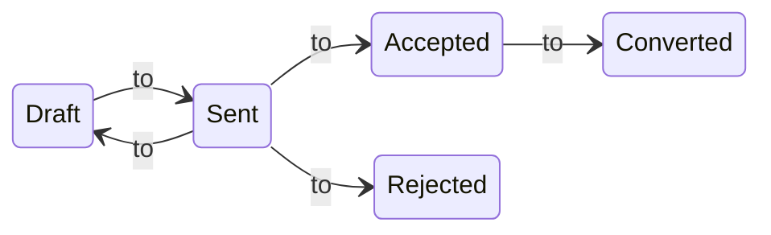

import TOCInline from '@theme/TOCInline';
import Mermaid from '@theme/Mermaid';

Fiskl offers flexible quoting options to help you provide detailed price estimates to your clients before finalizing a sale. This guide will walk you through creating a basic quote and then explore each component in detail for more advanced features.

## Before you start

While you can set up everything as you create your first quote, it's helpful to have the following in place:

1. Complete your Company settings, ensuring your address is correct
2. Create a client
3. Set up your products or services (optional)

## Creating a basic quote

Follow these steps to create a basic quote:

1. From the left menu, go to Sales
2. Select the plus button next to Quotes
3. Choose a client or add a new one
4. Add line items (products, services, expenses, time, or mileage)
5. Review and adjust details as needed
6. Click "Save and review"

## Quote components in detail

Let's examine each part of the quote for a comprehensive understanding:

<TOCInline toc={toc} />

### Company information

The quote pulls the following details from your Company settings:

1. Company name
2. Company address
3. Company ID or Registration number

:::info[tip]
You can customize your address layout in Company settings to change how it appears on quotes and invoices.
:::

### Client details

A client is required for quote creation. You can add a client in advance or while creating the quote. The quote uses:

1. Client name
2. Client address
3. Client email (including Cc and Bcc)
4. Tax/VAT Registration number
5. Defaults (Currency and time rate)

:::info
The client's Tax/VAT Registration number is shown if set in the client profile.
:::

### Quote number

The initial format is QUOTE-0001, incrementing with each new quote.

    
Learn more about customizing your quote number

    **You can customize this format, but there are limitations:**

    1. Auto-increment is only possible if the number ends with a digit
    2. Date-based formats (e.g., 2024-01-0001) require manual updates at each period change

To change the format, simply edit the quote number when creating a new quote. Subsequent quote will follow this new pattern.

### Quote dates

Quotes include two dates:

1. Quote date: Creation date or set quote
2. Valid until: Date until which the quote is valid

:::info
The initial number of days a quote is valid for can be set in Invoice and Quote settings. You can also change the valid until to extend or shorten the validity.
:::

### Quote status

Quotes follow this status flow:

---

:::info
Status changes occur based on client actions, valid till date and when you convert a quote to an invoice.
:::

### Styling

Customize quote appearance using themes, colors, and fonts in [Templates and brands](../../Settings-Configurations/templates-and-brands.md).

:::info[caution]
Changes to templates affect all quotes using that template. Consider creating a new template to not cause unwanted changes to previous quotes.
:::

### Line items

Create line items directly on the quote or in advance. Types include:

- [Products](../../Core-Features/Line-Items/products)
- [Services](../../Core-Features/Line-Items/services)
- [Expenses](../../Core-Features/Line-Items/expenses)
- [Mileage](../../Core-Features/Line-Items/mileage)
- [Time](../../Core-Features/Line-Items/time)

Products and Services are templates, while Expenses, Time & Mileage become billable when added to a quote.

### Taxes

Apply single, multiple, or compound taxes at the line item level. Taxes are calculated per item and displayed on the quote.

:::info[tip]
Toggle between tax-inclusive and tax-exclusive pricing using the tax +/- button.
:::

### Discounts

Add quote-level discounts as either fixed amounts or percentages.

See examples for fixed and percentage discounts

To make the amount entered a percentage just add a percentage sign at the end of the value. (e.g., `20%`)

- $100 discount = 100
- 15% discount = 15%

### Currency

Change the quote currency by selecting the currency name next to the Total. The initial currency is set to your Company currency unless the Client has a different currency specified.

:::info[tip]
You can adjust exchange rates for line items in different currencies.
:::

### Language

Choose from over 60 languages for quotes. This affects the quote, standard emails, and customer-facing screens.

You can customize your languages in [Invoice and Quote](../../Settings-Configurations/invoice-and-quote-settings.md) settings.

### Terms and conditions

Include your terms and conditions on each quote or set default terms in Invoice and quote settings.

Remember: Fiskl's quoting features are designed to be flexible and accommodate a wide range of business needs. Experiment with different options to find the setup that works best for your business.

## Converting quotes to invoices

Once a quote is accepted, you can easily convert it to an invoice:

1. Open the accepted quote
2. Click the "Actions" button
3. Select "Convert to invoice"
4. Review and adjust the invoice details as needed
5. Save and send the invoice

:::info
Converting a quote to an invoice will automatically update the quote status to "Converted".
:::
