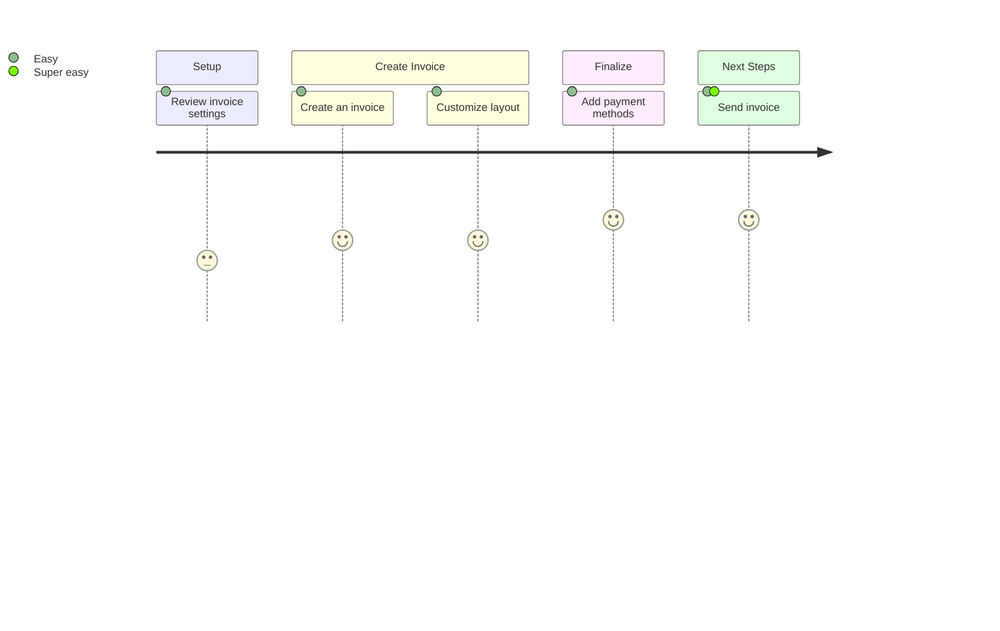
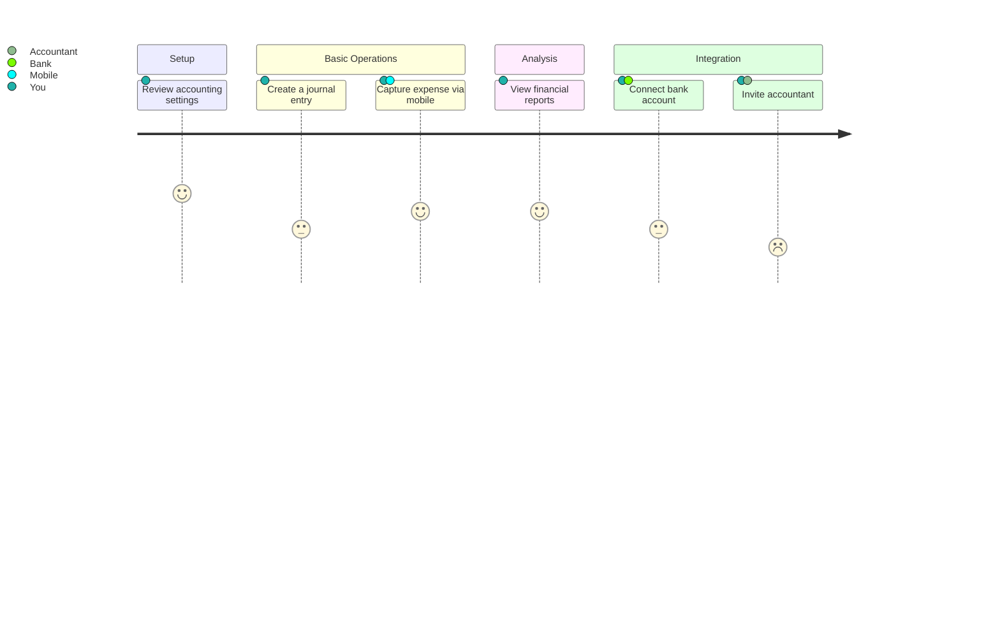
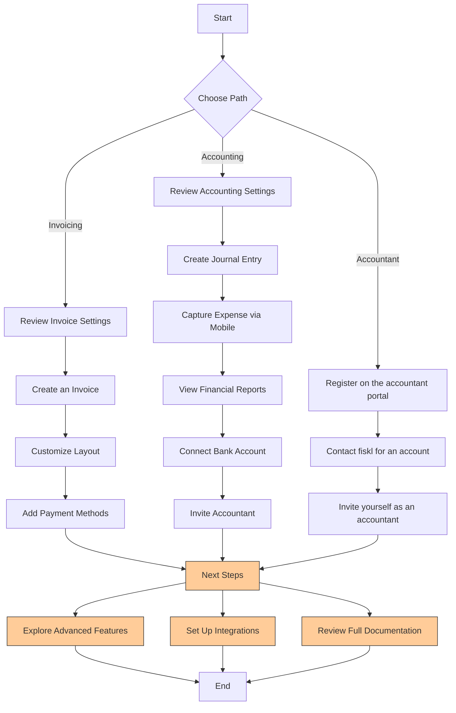

import Mermaid from '@theme/Mermaid';
import Tabs from '@theme/Tabs';
import TabItem from '@theme/TabItem';

# Getting started:

<Tabs>
  <TabItem value="invoicing" label="With invoicing" default>

:::note[Getting started with invoicing]

    1. [Review your settings](company-settings)
    1. [Create an invoice](company-settings)
    1. [Customize invoice](company-settings)
    1. [Add payment methods](company-settings)
    1. [Send invoice](company-settings)
:::

  </TabItem>
  <TabItem value="profile" label="With accounting">

:::note[Getting started with accounting]

    1. [Review accounting settings](company-settings)
    1. [Create a journal entry](company-settings)
    1. [Capture expense on mobile](company-settings)
    1. [View financial reports](company-settings)
    1. [Connect bank](company-settings)
    1. [Invite your accountant](company-settings)

:::

    </TabItem>

      <TabItem value="profiles" label="I'm an accountant">

      Getting started as an accountant

    </TabItem>
</Tabs>

---

## Alternative

