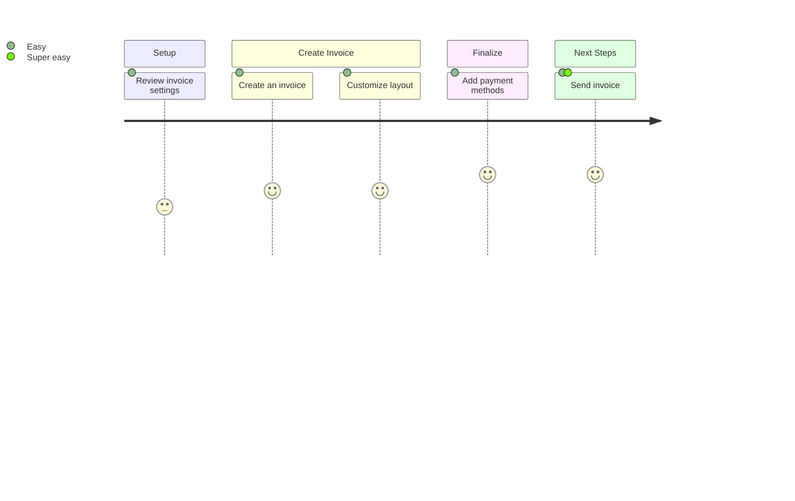
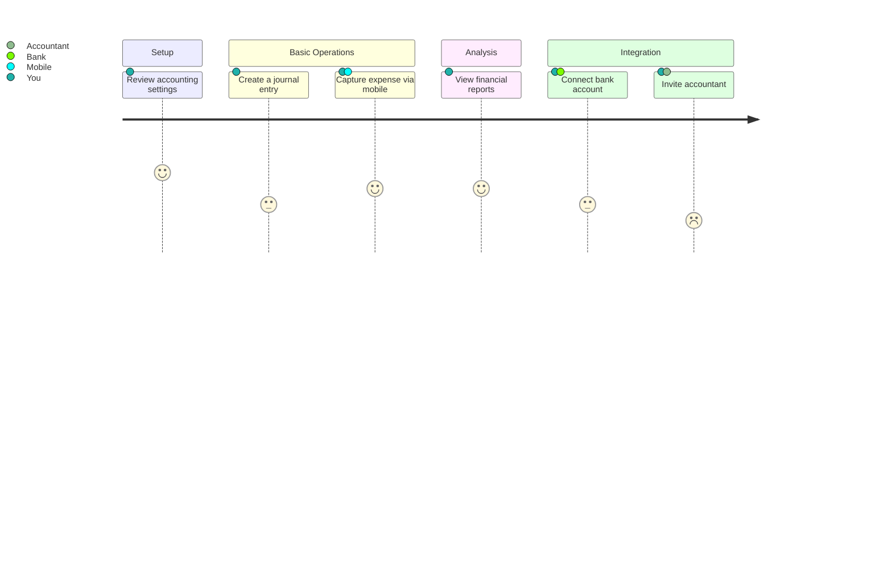
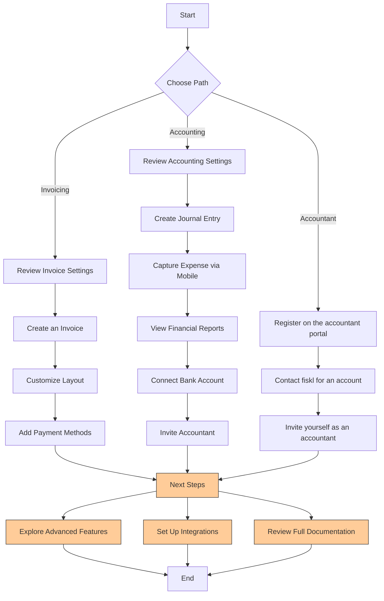

import Mermaid from '@theme/Mermaid';
import Tabs from '@theme/Tabs';
import TabItem from '@theme/TabItem';

# Getting started:

# Getting Started with Fiskl

Welcome to Fiskl! Let's get you set up quickly based on your primary needs.

## Choose Your Path

I want to start invoicing

1. [Set up your company profile](#set-up-your-company-profile)
2. [Customize your invoice](#customize-your-invoice)
3. [Set up payments](#set-up-payments)
4. [Create your first invoice](#create-your-first-invoice)
5. [What's next?](#whats-next-invoicing)

I want to manage my accounting

1. [Set up your company profile](#set-up-your-company-profile)
2. [Configure accounting settings](#configure-accounting-settings)
3. [Connect your bank](#connect-your-bank)
4. [Review your chart of accounts](#review-your-chart-of-accounts)
5. [What's next?](#whats-next-accounting)

I'm an accountant

1. [Register on the accounting portal](#register-on-the-accounting-portal)
2. [Set up your practice](#set-up-your-practice)
3. [Invite a client](#invite-a-client)
4. [What's next?](#whats-next-accountant)

## Set Up Your Company Profile

1. Log in to your Fiskl account
2. Navigate to Settings > Company Profile
3. Enter your company details
4. Save your changes

## Customize Your Invoice

1. Go to Settings > Invoice Settings
2. Choose a template
3. Add your logo
4. Customize colors and fonts

## Set Up Payments

1. Navigate to Settings > Payment Options
2. Choose 'Add Payment Gateway'
3. Select your preferred gateway (e.g., Stripe)
4. Follow the prompts to connect

## Create Your First Invoice

1. Click 'Create New' > 'Invoice'
2. Add line items for your products or services
3. Review and customize if needed
4. Click 'Send' to email it to your client

## Configure Accounting Settings

1. Go to Settings > Accounting Settings
2. Set your fiscal year
3. Choose your accounting method (Cash or Accrual)
4. Save your changes

## Connect Your Bank

1. Navigate to Banking > Add Bank Connection
2. Select your bank from the list
3. Follow the secure connection process
4. Start importing transactions

## Review Your Chart of Accounts

1. Go to Accounting > Chart of Accounts
2. Review the default accounts
3. Add or modify accounts as needed
4. Save your changes

## Register on the Accounting Portal

1. Visit the Fiskl Accountant Portal
2. Click 'Sign Up as an Accountant'
3. Complete the registration form
4. Verify your email address

## Set Up Your Practice

1. Log in to the Accountant Portal
2. Navigate to Practice Settings
3. Enter your practice details
4. Save your information

## Invite a Client

1. In the Accountant Portal, go to Clients > Invite Client
2. Enter your client's email address
3. Customize the invitation message
4. Click 'Send Invite'

## What's Next? (Invoicing)

- Explore recurring invoices for regular clients
- Set up expense tracking to monitor business costs
- Generate your first financial report

## What's Next? (Accounting)

- Import historical data if needed
- Set up bank rules for automatic transaction categorization
- Explore financial reports to gain insights into your business

## What's Next? (Accountant)

- Familiarize yourself with the client dashboard
- Explore Fiskl's accountant-specific features
- Consider reaching out to Fiskl to become a partner

Need help? Contact our support team at support@fiskl.com.

<Tabs>
  <TabItem value="invoicing" label="With invoicing" default>

:::note[Getting started with invoicing]

    1. [Review your settings](company-settings)
    1. [Create an invoice](company-settings)
    1. [Customize invoice](company-settings)
    1. [Add payment methods](company-settings)
    1. [Send invoice](company-settings)
:::

  </TabItem>
  <TabItem value="profile" label="With accounting">

:::note[Getting started with accounting]

    1. [Review accounting settings](company-settings)
    1. [Create a journal entry](company-settings)
    1. [Capture expense on mobile](company-settings)
    1. [View financial reports](company-settings)
    1. [Connect bank](company-settings)
    1. [Invite your accountant](company-settings)

:::

    </TabItem>

      <TabItem value="profiles" label="I'm an accountant">

      Getting started as an accountant

    </TabItem>
</Tabs>

---

## Alternative

