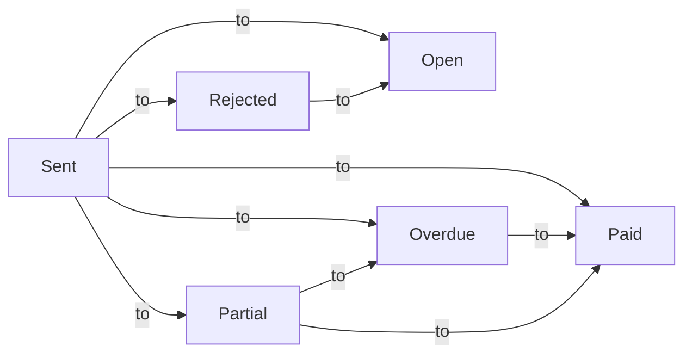

import TOCInline from '@theme/TOCInline';
import Mermaid from '@theme/Mermaid';

Invoicing in Fiskl ranges from basic to sophiscated. We will run through creating a basic invoice and then address each part of the invoice individually to explore the more advanced features. 
You do not need to pre-create any items as you can create everything as you create your first invoice but it can be useful to have the following set up in advance.

1. Complete your [Company Settings](../../getting-started/company-settings). Ensure your address is correct.
2. Create a `Client` 
3. Create a `Payment Method`. This can be using an integrated payment gateway like `Stripe` or adding a `Manual Payment` method.

## Basic invoice 

Try the interactive demo to create a basic invoice.

  <iframe
    style={{ position: 'absolute', top: 0, left: 0, width: '100%', height: '100%', border: 0 }}
    src="https://demo.fiskl.com/e/clzctmgxx008yl30czzc6urmn/tour"
    allowFullScreen
    webkitallowfullscreen="true"
    mozallowfullscreen="true"
    allowtransparency="true"
  ></iframe>

---

### Parts of an invoice 

Let't look at each part of the invoice in detail. 

<TOCInline toc={toc} />

---

#### Company [[dashboard]](https://my.fiskl.com/company-settings)

The invoice uses the following information from [Company Settings](../../getting-started/company-settings). 

1. Company name
2. Company address
3. Company ID or Registration number

:::info
All of the above can be overridden when using a [Brand Template](../../getting-started/templates-and-brands).

Your Company ID is not shown by default. You can change this in [Additional display options](../../getting-started/templates-and-brands#additional-display-options) on your `template`
:::

:::tip
In both [Company Settings](../../getting-started/company-settings) and [Brand Template](../../getting-started/templates-and-brands) you can customize your address layout to change how it appears on the invoice and quotes.
:::

#### Client [[dashboard]](https://my.fiskl.com/partners/clients)

A [Client](../clients/client-create) is required to create an invoice. You can create your client in advance or while creating the invoice.

The invoice uses the following information from [Client](../clients/client-create). 

1.  Client name
1.  Client address
1.  Client email including `Cc` and `Bcc`
1.  Tax/Vat Registration Number
1.  Defaults
    1.  Currency
    1.  Time rate
              
:::info
The format of the address can be changed in [Client](../clients/client-create#address)

Client `Tax/VAT Registration Number` is shown by default if set on the client [Client](../clients/client-create#general)
:::

#### Invoice number

The default of the invoice number is `INV-0001` and increments each time a new invoice is created. 
You can alter the invoice number to any format you like but there are some limitations. 
1. Fiskl can only incrementn the invoce number if it ends with a didget 
2. If your invoice follows a date pattern like `2024-01-0001` you will need to manually change the invoice number at each date period.

**How to change the invoice number?**
You change the format of the invocie number when creating a new invoice. Change the invoice number to the new format and all following emails will follow this pattern. 

:::info
When a new invoice is created Fiskl looks for the latest invoice and increments that invoice number. If you plan to change the invoice and have future invoices us this format it needs to be on the most recent invoice.
:::

#### Invoice dates

There are three dates on the invoice 

1. Invoice Date: The date the invoice was created
2. Due Date: The date the invoice is due
3. Sale Date: (Optional)

:::info
By default the `Due Date` is 7 days after the `Invoice Date`. This default setting can be changed in [Invoice & Quote settings](../settings/invoice-quote-settings)
:::

The [Invoice Overdue Status](#invoice-status) is based on the `Due Date` and the Invoice Payments. If the invoice is not fully paid on the Due Date then the invoice will become `Overdue`. If there are any `Overdue Reminders` they will be sent based on the `Due Date` and the overdue reminder chosen. 

#### Invoice Status 

Invoices have the following statuses the flows:
    

:::info
The invoice statues work using the Due Date and the paymetns. E.g if an invoice of $100 has a payment of $100 then the status will be `Paid`. If you change the payment to $80 the status will be `Partial`.

If you need to edit an invoice with payments you can change the status to `Open` to make it editable. However as soon as you change it it will revert to `Paid'.
What happens is that we disable the payments on the invoice allowing you to change the status to `Open` so that you can edit the invoice. When you save it if there are any payments we will restore these. 
:::

#### Styling
You can style the invoice using themes, colors and fonts. These are all done in the [Template](../../getting-started/templates-and-brands) under `Themes`, `Colours` and `Fonts`.

:::info[warning]
Any changes to the templates will affect all templates sent using the same template
:::

#### Line itmes

Line items can be created inline when creating the invoice or in advance in their dedicated screens. 

- Products*
- Services*
- Expenses
- Mileage
- Time

#### Taxes
#### Discounts
#### Deposits
#### Currency
#### Language
#### Additional values
#### Notes
#### Payment options
#### Payment terms
#### Payment schedules 